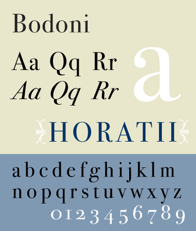
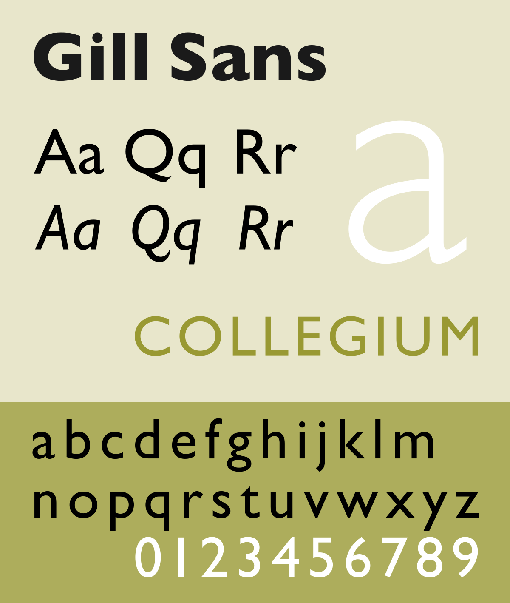

# Entendendo na Prática os Conceitos de Fonte e Tipografia

## Grupos Básicos

### Com Serifas

**Humanistas**: Primeiros tipos criados na Itália e se assemelhavam a caligrafia clássica. Dão alusão ao movimento da mão e da pena no papel.

- Kennerly

- Lynton

- Centaur

**Transacionais**: Serifas melhores desenhadas, menos desleixadas que os tipos humanistas. Baixo contraste no peso do traçado e serifas mais afiadas.

- Perpetua

- Times New Roman

- Baskerville

**Modernas**: Apresentam uma ruptura da tipografia tradicional, na época com alto contrastes de traços, serifas retas e um eixo totalmente vertical.

- Didot

- Wallbaum

- Bodini

**Egípcias**: Fontes com serifas retangulares bastante evidentes, geralmente da mesma espessura que as hastes

- Egyptienne

- Rockwell

- Clarendon

### Sem Serifas

**Humanistas**: Inspirados nos tipos romanos, com aspectos orgânicos. Boa legibilidade para leitura de textos extensos.

- Optima;

- Tahoma;

- Gil Sans;

**Transacionais**: Baseadas nos tipos grotescos, maior modulação em seus traços e uma construção mais refinada e simplificada. Indicadas para textos medianos a curtos, e para sinalização.

- Univers;

- Bell Gothic;

- Helvetica;

**Geométricas**: Tipos desenhados a partir de formas geométricas simples.

- Avenir

- Harmonia Sans

- Futura

### Scripts / Cursivas

**Transacionais**: Fonte que tem origem na escrita caligráfica italiana e se aproxima das fontes que se baseiam na escrita manual.

- Francesca

- Mistral

- Shelley

### Display / Decorativas

Tipos projetadas para uso em display / títulos, possuem muita amplitude e chama atenção. Adequadas apenas para textos curtos.

- Techno

- Comic

- Pixel

- Sancreek

## Anatomia

## Variáveis Tipográficas

### Parágrafos

Em parágrafo, linhas mais curtas farão uma grande diferença na leitura do layout.

Se a linha é muito curta e o usuário salta de linha constantemente, torna-se difícil absorver informações. Se o comprimento da linha for muito longo, os olhos se cansam rapidamente e o usuário desiste de ler.

- Manter um comprimento médio de linhas de 45 a 75 caracteres, incluindo espaços e pontos;
- Manter de 7 a 12 palavras por linha.

### Espaçamento entre Linhas

O espaçamento entre linhas molda a aparência dos parágrafos e a estrutura da página, dando ritmo vertical à medida em que o usuário acompanha o texto.

- Utilizar a escala `px * 1.5`;
- Para títulos, utilizar a esca  `1:1` ou `(px+10)`;
