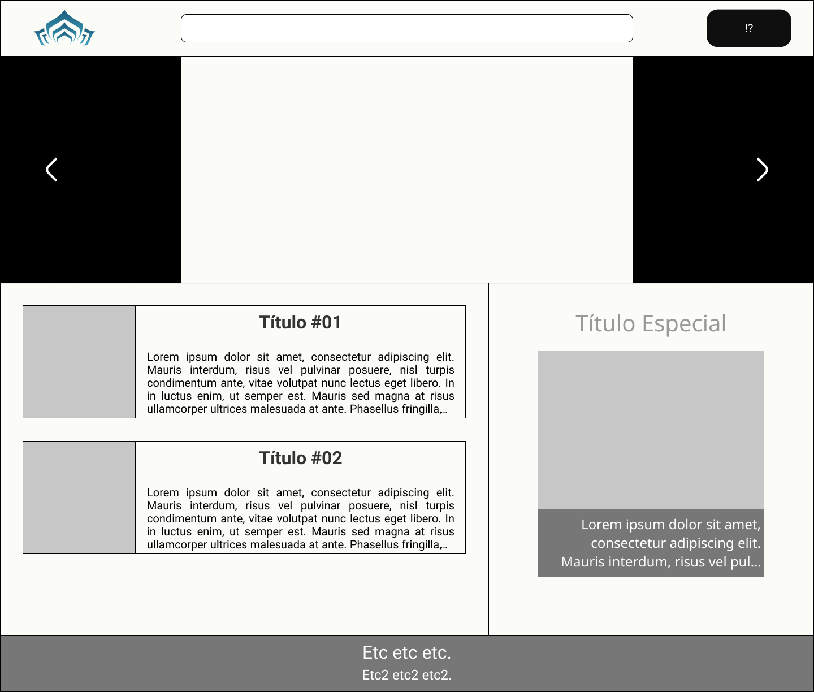
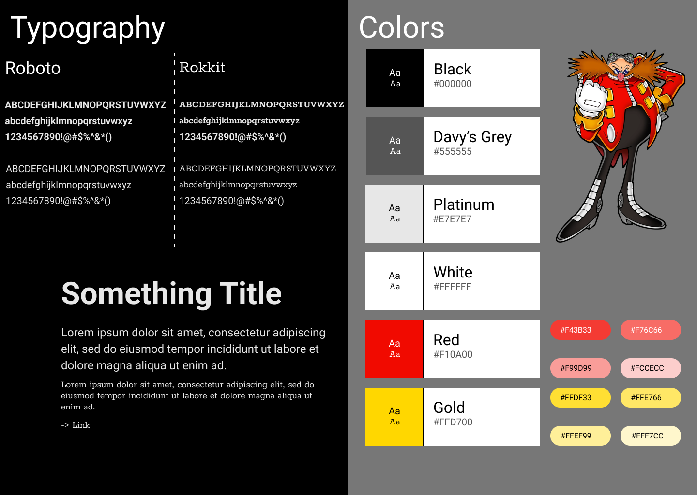
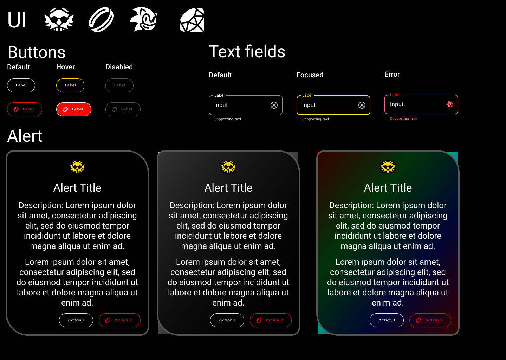

# Ampliando o seu Conhecimento em UX/UI Design

## [Introdução ao UX Design](./01_IntroUXDesign.md)

- Fundamentos da Usabilidade;
- Heurísticas de Nielsen;
- Lei de Hick;
- 8 Critérios de Scapin & Bastien;
- Fundamentos UX;
- Elementos da UX;
- Ferramentas;
- Padrões de Interface;

## Criando um Wireframe de Média Fidelidade

[Warframe Wireframe (med)](https://www.figma.com/file/20nqQN7eoQbw3BhWWVsOSX/Warframe-Wireframe-(Med)?type=design&node-id=0%3A1&mode=design&t=V95MDl976eL7zkOF-1)

## [Introdução ao UI Design](./02_IntroUIDesign.md)

- Wireframe;
- Cores;
- Espaçamentos
- Mensagens e Notificações;
- Design System e Atomic Design;

## Criando o seu Primeiro Design System

[Robtnik Design System](https://www.figma.com/file/l2mBPLB4q1xNl9LSFrAUP4/Robotnik-Noob-Design-System?type=design&node-id=12%3A11&mode=design&t=cDtBu9mTL0rR43HW-1)

## [Entendendo na Prática os Conceitos de Fonte e Tipografia](./03_Tipografia.md)

- Grupos de fontes (com serifas, sem serifas, cursivas, decorativas);
- Anatomia de fontes;
- Variáveis Tipográficas;
