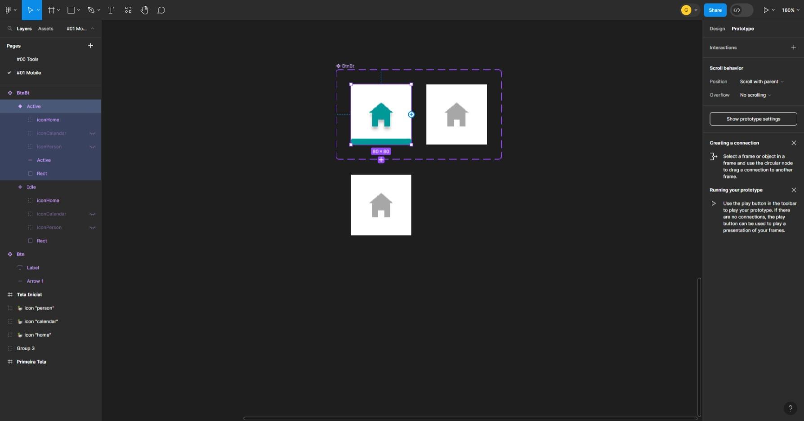

# Design Mobile e Prototipagem

## Introdução e Fundamentos

Existem dois padrões básicos para apresentação de conteúdo:

- **List View**: Apresenta vários itens em uma linha vertical contínua, com textos acompanhados por pequenos ícones. Requer menos espaço vertical, permitindo mais itens na tela simultaneamente. Mais adequado para dados homogêneos, seguindo um padrão de leitura natural em forma de F.
  - Vantagens:
    - Padrão de leitura natural.
    - Reduz a necessidade de scroll, exibindo mais opções em uma área visível.
  - Desvantagens:
    - Aparência visual modesta.
    - A atenção do usuário diminui de cima para baixo.
- **Grid View**: Apresenta um padrão repetido de células dispostas vertical e horizontalmente. Oferece uma varredura mais interrompida (zig-zag), sendo mais adequado para conteúdo visual. A atenção dos usuários é distribuída uniformemente entre as células.
  - Vantagens:
    - Visualização atraente.
    - Ajuda na distinção visual entre itens.
    - Distribui a atenção do usuário de forma uniforme.
  - Desvantagens:
    - Limita a quantidade de informação visível por scroll.
    - Cria um scroll extenso na página.

Wireframe VS Protótipo:

- Wireframe: Esqueleto gráfico de um site que orienta o conteúdo e conceitos das páginas.
  - Layout em preto e branco pode apresentar facilmente o grupo de informações principal, desenhar o contorna da estrutura e do layout e expressar o visual principal da interface do usuário.
- Protótipo: Versão simulada e interativa de uma interface de usuário que representa uma ideia mais próxima do produto final.
  - Próximo ao design de alta fidelidade;
  - É dinâmico e interativo, parecem quase com o produto final.

Resumo das diferenças:
Diferenças:

X| Wireframe | Protótipo
--- | --- | ---
Detalhes Visuais | Contém apenas elementos básicos, sem detalhes gráficos. | Inclui detalhes visuais mais refinados, proporcionando uma representação mais próxima do produto final.
Interatividade | Estático, não oferece funcionalidades interativas. | Pode ser interativo, permitindo a simulação de fluxos de usuário e funcionalidades básicas.
Finalidade | Foco na estrutura e layout, ideal para comunicação de conceitos e arquitetura da informação | Enfatiza a experiência do usuário, possibilitando testes de interação e feedback mais realistas
Estágio do design | Geralmente usado nas fases iniciais do design para estabelecer a estrutura básica | Criado em estágios mais avançados para testar e refinar a interatividade e o design visual.

## Criando um Protótipo Mobile

- Definição do Layout:

- Criando Estilo

- Criando Frames e Layout

- Componentização

- Variantes de Componentes

- Overflow e Scroll

