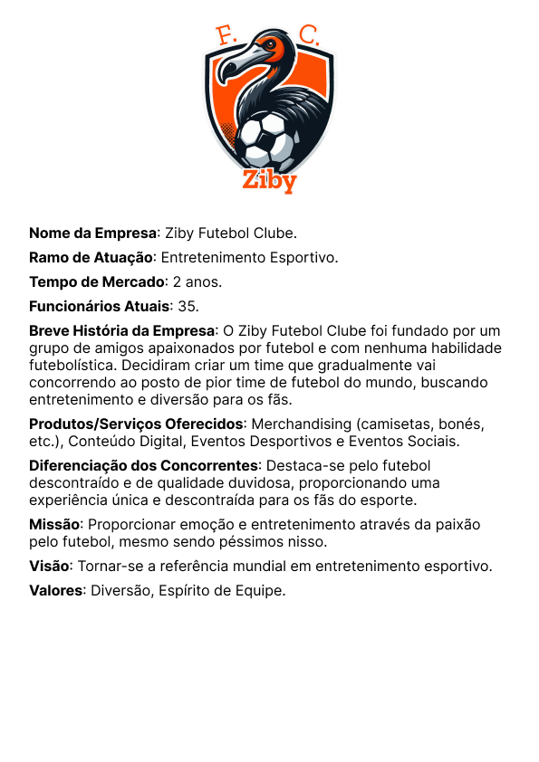
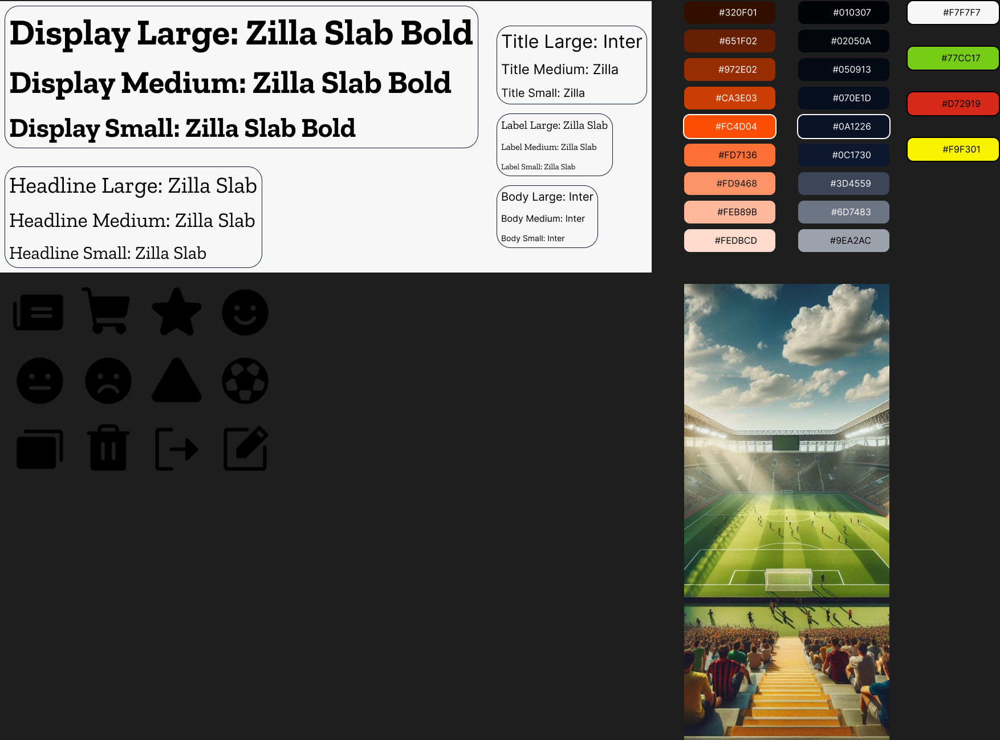
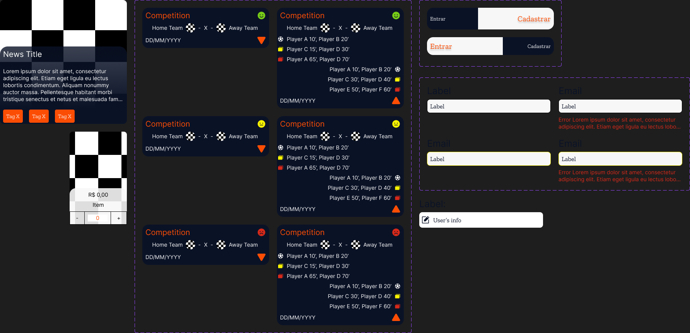
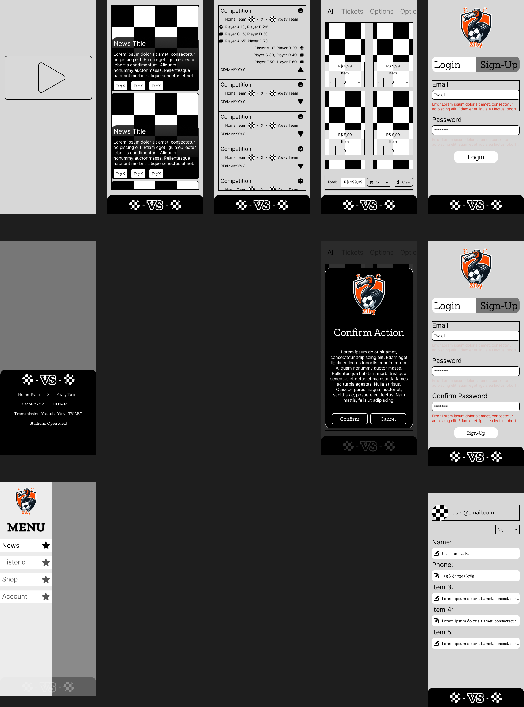
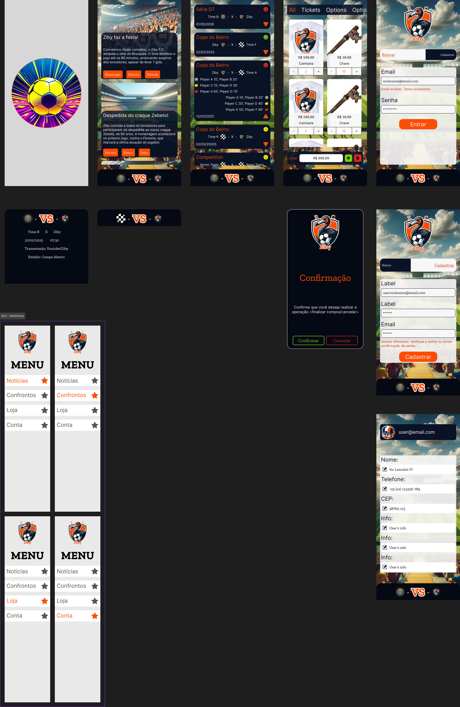

# Se Tornando um(a) UX/UI Designer Completo(a)

## Estratégias e Mercado UX/UI Designer

### 360 View

Técnica para ilustrar visualmente os pontos fortes e fracos do produto sobre:

- Vendas;
- Marketing;
- Design;
- Pesquisa;
- Tecnologias;

Na prática, desenha-se círculos intersectantes sobre **Desejabilidade**, **Viabilidade** e **Capacidade**; preenchendo-os com pontos positivos. Quanto aos pontos negativos, serão colocados do lado de fora.

### Definindo Público Alvo

- Sexo;
- Idade;
- Profissão;
- Interesse;
- Localização;

### Journey Map

Diagrama que ilustra visualmente o fluxo de interações de um usuário ao acessar a interface de um produto, seja um site ou um aplicativo.

- **Objetivo**: Permite que os designers identifiquem problemas de usabilidade que possam estar comprometendo a experiência do usuário.
- **Componentes**: Compila uma série de ações do usuário em uma linha do tempo. A partir disso, identifica as principais interações e pontos de contato, descrevendo em detalhes os objetivos, motivações e sentimentos do cliente em cada etapa.
- **Tipos de Mapas da Jornada do Usuário**:
  - **Mapas do Estado Atual** descrevem a experiência do usuário como ela é atualmente;
  - **Mapas do Estado Futuro** descrevem como os designers gostariam que a experiência do usuário fosse no futuro.

## Implementando Todas as Etapas para a Criação de um Protótipo Profissional

[Ziby](https://www.figma.com/file/8tPsKWWvdpFgqV6EPDTaVR/DIO%3A-Full-Ziby-Prototype?type=design&node-id=43%3A3542&mode=design&t=fLuB04KZXQBNPMwu-1)

